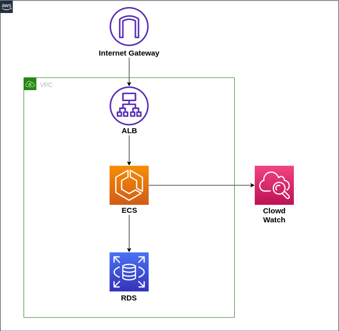

# BDAY
Demo rest app

### System diagram


### Build
```docker build -t samolander/bday:latest . ```
### Deploy  
See instructions [here](terraform/README.md) .
### Usage
**PUT data**

```curl -X PUT -H "Content-Type: application/json" -d '{ "DateOfBirth": "2016-01-02"}' http://sample.com/hello/sampleuser```

**GET data**

```curl http://sample.com/hello/sampleuser```

**extra endpoints:**

```
/metrics - metrics
/        - health check
```
